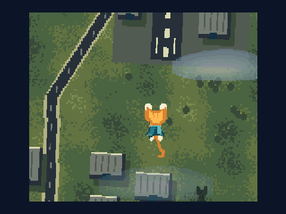

# V9968 Sample Demos

MSX turbo R + V9968の表示機能を試す技術デモ集です。ゲーム制作者の参考になるサンプルとして、ROM・ソース・検証記録を公開しています。試作・無保証で、実機動作や実機性能は未確認です。[免責事項](DISCLAIMER.md)・[利用条件](COPYRIGHT.md)を参照してください。

## 新しいデモ：SUPER CAT / COASTAL FLIGHT

短いマントを背中に付けた猫が、提灯と肉球飾りでお祭り中の巨大屋形船へ飛んできます。見た目はジョーク、描画は本気の全画面変形です。**全画面の回転・拡大縮小・前方スクロール**を同時に行い、旋回中も前進し続ける512KiB ASCII8技術デモです。上昇・降下に応じた地形の倍率、影の変化、半透明の雲を組み合わせています。



- **[詳しい説明・起動方法 / Instructions](demos/super-cat-coastal-flight/README.md)**
- **[36秒のMP4・無音 / Native video](https://github.com/kanon-ai/V9968_SampleDemo/raw/refs/heads/main/demos/super-cat-coastal-flight/outputs/SUPER_CAT-COASTAL_FLIGHT.mp4)**
- **[ROM・ソース一式 / Download ZIP](https://github.com/kanon-ai/V9968_SampleDemo/raw/refs/heads/main/demos/super-cat-coastal-flight/outputs/SUPER_CAT-COASTAL_FLIGHT-source-and-ROM.zip)**
- [内蔵V9968エミュレーター用ROM / Internal V9968 ROM](demos/super-cat-coastal-flight/outputs/SUPER_CAT-COASTAL_FLIGHT-V9968-legacy-openmsx-internal.rom)

実行録画は約59.92fpsで、補間や速度変更はありません。内蔵V9968のlegacy-openMSX構成で全画面変形の約59.92更新／秒、ループ、前進方向、原画転送、再ビルド一致を確認しました。実機・現行FPGA・外付け構成は未検証です。試作・無保証であり、継続的な修正・サポートは約束していません。

**SUPER CAT / COASTAL FLIGHT** is an original automatic V9968 full-screen transform demo with continuous forward flight, banking, altitude changes, translucent clouds and a short-caped cat. The native MP4 retains approximately59.92 fps without interpolation. The internal legacy-openMSX profile was tested; physical hardware, current FPGA and external configurations are unverified. Supplied experimentally, without warranty or a commitment to support.

---

## CATSTRIDER

斜め後ろ姿の猫が、高速に流れる宇宙の床を滑走し、写真調の猫缶と銀桃色の鯛に出会います。112走査線のLRMM遠近描画、Sprite mode3の拡縮・半透明、光のリングと星の光跡を組み合わせた、**512 KiB ASCII8・約51.3秒の自動再生デモ**です。操作を伴うゲームではありません。

ネコ素材はAI生成です。

魚と猫缶の素材もAI生成です。


- **[詳しい説明・起動方法 / Instructions](demos/catstrider/README.md)**
- **[全編MP4・PSG音声付き / Video](https://github.com/kanon-ai/V9968_SampleDemo/raw/refs/heads/main/demos/catstrider/outputs/CATSTRIDER-smooth.mp4)**
- **[ROM・ソース一式 / Download ZIP](https://github.com/kanon-ai/V9968_SampleDemo/raw/refs/heads/main/demos/catstrider/outputs/CATSTRIDER-V9968-source.zip)**
- [内蔵V9968エミュレーター用ROM / Internal V9968 ROM](https://github.com/kanon-ai/V9968_SampleDemo/raw/refs/heads/main/demos/catstrider/outputs/CATSTRIDER-V9968-legacy-openmsx-internal.rom)
- [実装メモ / Implementation notes](demos/catstrider/TECHNIQUES.md)

内蔵・外付けの両openMSX構成で、54秒の実行と一周後の再開を検証しました。シーン更新は29.9614回／秒、MP4は59.92 fpsの実行録画を補間せず保持しています。GIFは30 fps、5秒地点から15秒の抜粋です。対象はV9968対応openMSX d884c4bで、実機・現行FPGAでの動作や性能は未確認です。

**CATSTRIDER** combines a photographic-looking rear-facing cat, generic cat-food tins and silver-and-pink sea bream with a fast perspective floor, scaled and translucent Sprite3 artwork, portals and star streaks. This original 512 KiB ASCII8 sample plays automatically for about 51.3 seconds per loop; it is noninteractive. Both tested openMSX configurations measured 29.9614 scene updates per second. The MP4 retains native 59.92 fps recording and PSG sound without interpolation. Physical hardware and the current FPGA configuration remain unverified.

The cat asset is AI-generated. The fish and cat-food tin assets are also AI-generated.

---

## MIST / VALE

朝焼けの山を背景に、木々と手前の岸辺が一緒に水平へ流れ、少し速い半透明の霧が漂います。水面だけを走査線割り込みで揺らす、512KiB ASCII8の風景デモです。木・草・石・水際は同じスクロール位置を使い、足元が地面に対して滑らないようにしています。


- **[詳しい説明・起動方法 / Instructions](demos/mist-vale/README.md)**
- **[滑らかなMP4・音声付き / Video](https://github.com/kanon-ai/V9968_SampleDemo/raw/refs/heads/main/demos/mist-vale/outputs/MIST_VALE-smooth.mp4)**
- **[ROM・ソース一式 / Download ZIP](https://github.com/kanon-ai/V9968_SampleDemo/raw/refs/heads/main/demos/mist-vale/outputs/MIST_VALE-source-and-ROM.zip)**
- [内蔵V9968エミュレーター用ROM / Internal V9968 ROM](https://github.com/kanon-ai/V9968_SampleDemo/raw/refs/heads/main/demos/mist-vale/outputs/MIST_VALE-V9968-legacy-openmsx-internal.rom)
- [実装メモ / Implementation notes](demos/mist-vale/TECHNIQUES.md)

SCREEN8への背景合成、Sprite mode3の半透明、R19/R27による水面ラスタを組み合わせています。独立した背景ハードウェアレイヤーを複数使う方式ではありません。両エミュレーター構成で約59.93回／秒の更新を確認し、地面との同期、表示中ページへの書込み防止、霧の混色、ソースからの再ビルド一致も検証しました。GIFは30fps、MP4は約59.92fpsの実行録画です。実機動作・実機性能は未確認です。

**MIST / VALE** combines a stationary dawn landscape, trees and shoreline moving together, faster translucent fog, and raster-driven water ripples. This original 512 KiB ASCII8 sample uses SCREEN8 compositing, Sprite3 blending and line interrupts. Both emulator profiles were checked at about59.93 updates per second, including ground/tree synchronization and safe page presentation. The GIF and MP4 show actual ROM execution. Hardware operation/performance is unverified; the sample is provided without warranty or a commitment to support.

---

## LUMEN / FORGE

固定された光の展示室で、半透明の結晶と金色の光輪が別々の方向へ回転し、拡大・縮小します。FG4付きLRMMで2つの原画を実時間変形し、Sprite mode3で拡縮と半透明を組み合わせています。512KiB ASCII8 ROMです。


- **[詳しい説明・起動方法 / Instructions](demos/lumen-forge/README.md)**
- **[滑らかなMP4・音声付き / Video](https://github.com/kanon-ai/V9968_SampleDemo/raw/refs/heads/main/demos/lumen-forge/outputs/LUMEN_FORGE-smooth.mp4)**
- **[ROM・ソース一式 / Download ZIP](https://github.com/kanon-ai/V9968_SampleDemo/raw/refs/heads/main/demos/lumen-forge/outputs/LUMEN_FORGE-source-and-ROM.zip)**
- [内蔵V9968エミュレーター用ROM / Internal V9968 ROM](https://github.com/kanon-ai/V9968_SampleDemo/raw/refs/heads/main/demos/lumen-forge/outputs/LUMEN_FORGE-V9968-legacy-openmsx-internal.rom)
- [実装メモ / Implementation notes](demos/lumen-forge/TECHNIQUES.md)

GIFは実行録画から作成した30fpsのプレビューです。MP4は約59.92fpsの記録を保持し、フレーム補間や速度変更はありません。両エミュレーター構成で約59.93回／秒の更新を確認しました。実機の測定値ではありません。

**LUMEN / FORGE** combines two live FG4 LRMM rotations, independent Sprite3 scaling and transparency over a stationary SCREEN8 scene. It is a 512 KiB ASCII8 technical sample for creators. The 30 fps GIF comes from actual ROM execution; the linked MP4 retains native emulator cadence and PSG audio. Hardware operation/performance remains unverified. See the linked Japanese/English instructions and terms.

---

## PRISM FLIGHT — V9968 warmup demo

**MSX turbo R + V9968 / 128 KiB ASCII8 ROM / Kanon × ASTRA (Codex)**

青紫の光る空間が画面全体で回転・ズームし、6個の多色結晶が奥行きを変えながら周回する、小さなV9968デモです。原画・動き・PSGの短いフレーズは本デモ用に生成しました。


*実際のROM実行を撮影した12秒・12fpsの無音GIF。Actual ROM execution in V9968-enabled openMSX; 12-second silent preview at 12 fps.*

- [ROM・ソース一式をダウンロード](https://github.com/kanon-ai/V9968_SampleDemo/raw/refs/heads/main/outputs/PRISM_FLIGHT-source-and-ROM.zip)
- [内蔵V9968エミュレーター用ROM](https://github.com/kanon-ai/V9968_SampleDemo/raw/refs/heads/main/outputs/PRISM_FLIGHT-V9968-legacy-openmsx-internal.rom)
- [English instructions](#english)

これは機能確認用の試作です。実機動作・実機速度は未確認で、無保証です。性能限界を測定したベンチマークではありません。詳細は[免責事項](DISCLAIMER.md)と[利用条件](COPYRIGHT.md)を参照してください。

## 最初に動かす場合

1. [buppu3氏の配布ページ](https://buppu3.github.io/)からV9968対応openMSXを用意します。今回の検証対象はWindows版 `openmsx-21.0-v9968-d884c4b-x64-VC-Release.zip` です。通常のV9968未対応openMSXでは動きません。
2. [Panasonic_FS-A1ST_V9968.xml](https://buppu3.github.io/openMSX/share/machines/Panasonic_FS-A1ST_V9968.xml)を、そのopenMSXの `share/machines/` に保存します。
3. FS-A1STのBIOSなど、マシン定義が要求するシステムROMは利用条件に従って各自で用意してください。本リポジトリには含まれていません。
4. マシン `Panasonic_FS-A1ST_V9968` を選び、次のROMをカートリッジとして読み込みます。

**`outputs/PRISM_FLIGHT-V9968-legacy-openmsx-internal.rom` — ASCII8、128KiB**

`run-demo.cmd` を実行するか、このROMをopenMSXのカートリッジに読み込み、ASCII8を指定してください。起動とVRAM転送に約6秒かかり、その後は自動ループします。終了はopenMSXのウィンドウを閉じます。

Windows用ランチャーは既定で `C:/Program Files/openMSX/openmsx.exe` を参照します。別の場所にある場合は `OPENMSX_EXE` 環境変数に実行ファイルのフルパスを指定してください。マシン定義は事前に上記の手順で導入します。起動時にデモ専用の `work/emulator/` を作成します。

外付け構成を使う場合は、[HRA_V9968.xml](https://buppu3.github.io/openMSX/share/extensions/HRA_V9968.xml)を `share/extensions/` に保存し、`Panasonic_FS-A1ST` + `HRA_V9968` 拡張を選びます。ROMは下表の `legacy-openmsx.rom`、映像出力は `V9968` を選択してください。

## ROMの使い分け

| ファイル末尾 | 対象 | I/O | レジスター仕様 | 検証 |
|---|---|---|---|---|
| `legacy-openmsx-internal.rom` | `Panasonic_FS-A1ST_V9968` | 98h–9Ch | 旧R20 ECOM/EVR | 今回の実行・撮影対象 |
| `legacy-openmsx.rom` | `Panasonic_FS-A1ST` + `HRA_V9968`拡張 | 88h–8Ch | 旧R20 ECOM/EVR | エミュレーター実行確認 |
| `current.rom` | 現行FPGA仕様の外付けV9968 | 88h–8Ch | R21=3Ah、R20=1Fh | ビルドのみ、実機未確認 |

3つともASCII8の128KiB ROMです。旧エミュレーターと現行FPGAの初期化を混同しないため分けています。この検証版エミュレーターでは、マシンXMLのVRAM値にかかわらずV9968選択時に256KiBを確保します。

## サンプルと検証

- `outputs/PRISM_FLIGHT-emulator.gif`：実際のROM実行を撮影した12秒のGIF。12fpsに間引いた無音プレビューです。
- `outputs/PRISM_FLIGHT-emulator.png`：同じ実行からの静止画。
- `outputs/verification.json`：ROM・エミュレーターのSHA-256、構成、実測更新回数、検証範囲。

2つの旧仕様用ROMをそれぞれ約42秒のエミュレーター時間で実行し、ループ境界の通過、R800 DRAM動作、描画ページ切替、原画64KiBのVRAMへの完全一致、6スプライト後の終端を確認済みです。エミュレーター上では約59.91回/秒の描画更新でした。GIF撮影は等速・フレームスキップなしで実行し、12fpsで採取しています。エミュレーター上の更新速度から実機速度を保証することはできません。現行FPGA仕様のROMには、対応エミュレーターまたは実機での追加検証が必要です。

## 使った機能

- SCREEN5、256×212。RGB各5bitの拡張パレット。
- LRMMによる背景全体の回転・拡大縮小。
- Sprite mode3の多色表示・パレット群・サイズ変更。結晶は1個ずつ16×32の原画です。
- 表示ページとスプライト属性テーブルを二重化。
- R800側は座標テーブルの読出しとコマンド発行を担当し、画素変換をVDPへ渡します。

ROMに動画の完成画面を大量格納する方式ではありません。原画32KiB、スプライト原画32KiB、512フレーム分の座標・属性32KiBを持ち、VDPが毎回画像を作ります。1周は512回の描画更新です。背景パレットも更新し、PSGの1声を鳴らします。操作やゲーム要素はありません。

## 再ビルド・変更箇所

Python 3、Pillow、[Pasmo](https://pasmo.speccy.org/)を使用します。検証環境はPython 3.13 / Pillow 12.2.0です。`PASMO`環境変数で実行ファイルを指定できます。未指定時はPATHまたは `C:/Software/Pasmo/pasmo.exe` を使用します。

```powershell
python -m pip install -r requirements.txt
$env:PASMO = 'C:/path/to/pasmo.exe'
python tools/build.py
# Windows: the V9968 emulator, both XML files and your BIOS must be installed first.
python tools/verify.py
```

検証には上記のユーザー所有openMSX環境が必要です。通常ビルドはエミュレーターやBIOSを要求しません。

- `tools/generate.py` の `background()`：背景の形。
- 同 `sprites()`、`palette()`：結晶・色。
- 同 `frame_records()`：回転、ズーム、軌道、遠近の変化。
- `src/demo.asm`：V9968初期化、LRMM発行、表示切替。
- `src/boot.asm`：ASCII8の起動とR800への切替。

`assets/*-art.png` は生成原画の確認用で、エミュレーター画面ではありません。撮影結果は `outputs/*-emulator.*` です。`work/` は実行時に作られる作業用ディレクトリーで、GitHubには含めません。ランチャー設定は `tools/preview.tcl` にあります。

## 参照資料

- [buppu3氏のV9968対応openMSX配布ページ](https://buppu3.github.io/)
- [検証バイナリーに対応するopenMSX source d884c4b](https://github.com/buppu3/openMSX/tree/d884c4b29d7e736d6e488aca5f28e124a410c19f)
- [HRA!氏のV9968 FPGA資料・実装](https://github.com/hra1129/V9968_Cartridge/tree/ceeecd7e3c2d25c20045f797617af0f70ca228c1)

現行版では設計者の補足に合わせて、ポート4で拡張レジスターアクセスを許可し、R21は固定ビットを含む3Ahを指定します。Sprite mode2の新しいパレット群指定には依存していません。

## English

An original 128 KiB ASCII8 warmup demo for MSX turbo R + V9968: full-screen LRMM rotation/zoom, six scaled multicolor mode-3 sprites, RGB5 palette animation and a small PSG phrase. The ROM contains original indexed artwork and motion parameters; the VDP renders the transformed images at runtime. It is not a prerecorded frame sequence.

1. Obtain the V9968-enabled Windows openMSX from [buppu3's page](https://buppu3.github.io/). The tested binary is `openmsx-21.0-v9968-d884c4b-x64-VC-Release.zip`.
2. Download [Panasonic_FS-A1ST_V9968.xml](https://buppu3.github.io/openMSX/share/machines/Panasonic_FS-A1ST_V9968.xml) into its `share/machines/` directory and provide your own legally usable FS-A1ST system ROMs.
3. Select that machine and load **`outputs/PRISM_FLIGHT-V9968-legacy-openmsx-internal.rom`** with mapper **ASCII8**. Allow about six seconds for boot and initial VRAM upload; the demo loops automatically.
4. On Windows, `run-demo.cmd` starts this configuration. Set `OPENMSX_EXE` if your executable is not under `C:/Program Files/openMSX/`.

For the external cartridge configuration, install [HRA_V9968.xml](https://buppu3.github.io/openMSX/share/extensions/HRA_V9968.xml) into `share/extensions/`, select `Panasonic_FS-A1ST` + `HRA_V9968`, load **legacy-openmsx.rom**, and select the **V9968** video source.

Both legacy profiles were tested for 42 emulated seconds, including loop wrap, page flipping and byte-exact asset upload. About 59.91 demo updates/second were observed in this emulator. The current FPGA build uses a different register map and has not been run on hardware. The GIF is a 12 fps sample of actual emulator output; it is not evidence of hardware frame rate.

Build with Python 3, Pillow and Pasmo: `python -m pip install -r requirements.txt`, then `python tools/build.py`. Set `PASMO` to your assembler executable if needed. Source and ROM hashes are included in `outputs/`; `python tools/verify.py` requires the Windows emulator environment described above.

This is an experimental demo, provided **AS IS, without warranty or a commitment to fixes/support**. See [DISCLAIMER.md](DISCLAIMER.md), [COPYRIGHT.md](COPYRIGHT.md) and [THIRD_PARTY_NOTICES.md](THIRD_PARTY_NOTICES.md). BIOS, emulator binaries and third-party machine XMLs are not bundled.
