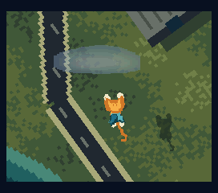
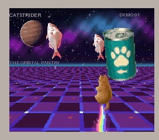
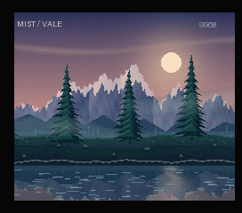
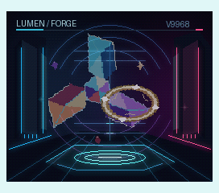
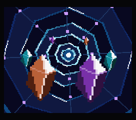

# V9968 Sample Demos — v2.0.0

**新仕様V9968対応版を公開しました。2026年9月23日時点では、V9968対応BlueMSX Plusでのみ動作確認しています。新バージョンの実行にはV9968対応BlueMSX Plusをご使用ください。**

旧バージョンはopenMSXの互換モードで動作可能です。[旧版の起動方法](UPDATE-20260922.md)は引き続き参照できます。

**The new version targets the current V9968 specification. As of September 23, 2026, it has been verified only with V9968-capable BlueMSX Plus. Please use V9968-capable BlueMSX Plus to run it. The previous version remains runnable in openMSX compatibility mode.**

- **[v2.0.0 ダウンロード / Release](https://github.com/kanon-ai/V9968_SampleDemo/releases/tag/v2.0.0)**
- **[新版のROM一覧・起動方法・再ビルド / Current ROMs and instructions](current/README.md)**
- [確認環境・検証範囲 / Verification](current/verification.json)

MSX turbo R + V9968の描画機能を、楽しめる映像で紹介する自動再生の技術デモ集です。5本とも現行のモードレジスターとVRAM配置に対応し、原画・動き・音は維持しています。実機を目標にしていますが、実機での動作・性能は未確認です。試作・無保証で、継続的な修正・サポートを約束するものではありません。[免責事項](DISCLAIMER.md)・[利用条件](COPYRIGHT.md)を参照してください。

## SUPER CAT / COASTAL FLIGHT

全画面の回転・拡縮・前方スクロールで、短いマントの猫がお祭り中の屋形船を巡ります。仮想光源に合わせた影、半透明の雲、船上で踊る猫。見た目はジョーク、描画は本気の512KiBデモです。

[新版ROM](current/roms/SUPER_CAT-COASTAL_FLIGHT-V9968-current-internal.rom) · [BlueMSX Plus動画](current/previews/SUPER-CAT-blueMSX-100percent.mp4) · [技術解説](demos/super-cat-coastal-flight/TECHNIQUES.md)

## CATSTRIDER

猫、写真調の魚、架空の猫缶が宇宙を飛ぶ疑似3Dデモ。112走査線の遠近描画と、Sprite mode3の拡縮・半透明を組み合わせています。512KiB。ネコ素材はAI生成です。魚と猫缶の素材もAI生成です。

[新版ROM](current/roms/CATSTRIDER-V9968-current-internal.rom) · [BlueMSX Plus動画](current/previews/CATSTRIDER-blueMSX-100percent.mp4) · [技術解説](demos/catstrider/TECHNIQUES.md)

## MIST / VALE

朝焼けの山、木々と岸辺の同期スクロール、半透明の霧、水面だけを揺らすラスター。512KiB。

[新版ROM](current/roms/MIST_VALE-V9968-current-internal.rom) · [技術解説](demos/mist-vale/TECHNIQUES.md)

## LUMEN / FORGE

回転する結晶と光の輪。拡縮と半透明の重ね合わせを使った512KiBデモです。

[新版ROM](current/roms/LUMEN_FORGE-V9968-current-internal.rom) · [技術解説](demos/lumen-forge/TECHNIQUES.md)

## PRISM FLIGHT

回転・拡縮する背景と結晶を組み合わせた128KiBの導入デモです。

[新版ROM](current/roms/PRISM_FLIGHT-V9968-current-internal.rom)

## 版と実行環境 / Versions

| 版 | 実行環境 | 案内 |
|---|---|---|
| v2.0.0 新仕様 / Current specification | V9968対応BlueMSX Plus | [新版](current/README.md) |
| 旧版 / Previous version | V9968対応openMSXの互換モード | [旧版](UPDATE-20260922.md) |

V9968対応BlueMSX Plusの検証ビルドは、experimental/v9968ブランチの指定コミットです。通常配布版との区別を含め、[起動方法](current/README.md)を確認してください。BIOSとエミュレータ本体は同梱していません。

The five demos preserve their original artwork, motion and sound while adopting the current V9968 configuration. They are noninteractive technical samples, not completed games. Hardware operation and performance remain unverified; supplied experimentally and without warranty. See the current-version guide for the exact V9968-capable BlueMSX Plus build and test scope.
