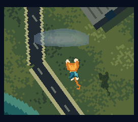
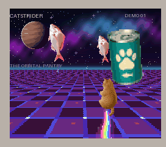
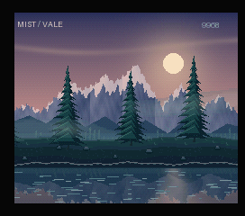
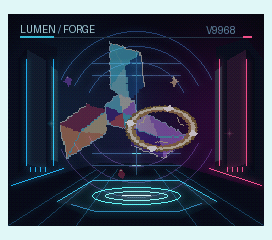
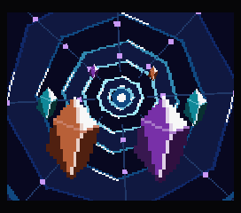

# V9968 Sample Demos — v2.0.0

## VRAM READ LAB v0.2 — experimental diagnostic / 2026-10-09

V9968のCPUによるVRAM読み出しを調べる診断ソフトを追加しました。Z80／R800比較、読み間隔の変更、最初の異常アドレス・期待値・実測値・ビット別件数、Memtest風の領域マップを表示します。各32KiB通常ROM、外付け88h版と内蔵98h版を用意しています。

**本診断ソフトはopenMSXで検証済み、BlueMSX Plus・実機は未確認です。試作・無保証です。下記の既存デモの検証状況を本診断ソフトに適用しないでください。**

[診断ROM・ソース・説明書](diagnostics/vram-read-lab/README.md) · [ダウンロード](https://github.com/kanon-ai/V9968_SampleDemo/releases/tag/vram-read-lab-v0.2) · [利用条件](diagnostics/vram-read-lab/LICENSE.md) · [免責](diagnostics/vram-read-lab/DISCLAIMER.md)

Experimental CPU VRAM read diagnostic. Verified in the documented openMSX configurations only; **BlueMSX Plus and physical hardware are not yet verified**. Separate from the existing graphics demos. Includes 32KiB normal ROMs for external 88h and internal 98h I/O profiles, source and diagnostic documentation.

## Z80最適化版 / Z80 optimization — 2026-10-05

**CATSTRIDERとCAPE CIRCUITのZ80最適化版を追加しました。** 検証したZ80モードでは両方とも約20→30更新/秒。原画・描画内容を維持し、R800でも確認しました。V9968は引き続き必要です。

[最適化版ROM・使い方・測定結果](z80/README.md) · [まとめてダウンロード](https://github.com/kanon-ai/V9968_SampleDemo/releases/tag/z80-update-20261005)

CPU-optimized editions of CATSTRIDER and CAPE CIRCUIT improve from about 20 to 30 updates/s in the tested Z80 configuration. V9968 is still required. See the linked guide for emulator coverage and hardware limitations. Earlier releases remain available below.

**新仕様V9968対応版を公開しました。2026年9月23日、公開済みv2.0.0の全5本をV9968対応BlueMSX PlusとopenMSX V9968 c620b69の双方で動作確認しました。新版はどちらでも実行できます。openMSXでは新仕様の `V9968` を使用し、互換モードは使用しません。**

旧バージョンはopenMSXの互換モードで動作可能です。[旧版の起動方法](UPDATE-20260922.md)は引き続き参照できます。

**The new version targets the current V9968 specification. As of September 23, 2026, all five v2.0.0 demos have been verified with both V9968-capable BlueMSX Plus and openMSX V9968 c620b69. Either tested emulator can run this version; use current-specification V9968 mode in openMSX, not compatibility mode. The previous version remains runnable in openMSX compatibility mode.**

- **[v2.0.0 ダウンロード / Release](https://github.com/kanon-ai/V9968_SampleDemo/releases/tag/v2.0.0)**
- **[新版のROM一覧・起動方法・再ビルド / Current ROMs and instructions](current/README.md)**
- [BlueMSX Plus検証記録](current/verification.json) · [openMSX追加検証・今後の方針](current/OPENMSX-20260923.md)

MSX turbo R + V9968の描画機能を、楽しめる映像で紹介する自動再生の技術デモ集です。5本とも現行のモードレジスターとVRAM配置に対応し、原画・動き・音は維持しています。実機を目標にしていますが、実機での動作・性能は未確認です。試作・無保証で、継続的な修正・サポートを約束するものではありません。[免責事項](DISCLAIMER.md)・[利用条件](COPYRIGHT.md)を参照してください。

## CAPE CIRCUIT — LRMM experiment / updated 2026-09-27

**V9968のLRMMを試すための、操作不要の技術デモです。** スーパーキャットとスーパーウサギがオリジナルのネオンコースを競走します。120走査線の遠近投影と座標補正、上昇・下降、路面バンクの近似、Sprite mode3の拡縮、半透明の航跡。夕空と街並み、後ろ姿のウサギ、高さを固定した単独の月も更新しました。512KiB ASCII8。openMSXとBlueMSX Plusの新仕様モードで検証済み、実機は未確認です。

A noninteractive technical demo for experimenting with V9968 LRMM. Original course and characters; 512KiB ASCII8. Verified with both current-specification emulators, not yet on physical hardware. This is an additional sample; the five v2.0.0 ROMs remain unchanged.

[ROM](demos/cape-circuit/outputs/CAPE-CIRCUIT-V9968.rom) · [動画 / Video](demos/cape-circuit/outputs/CAPE-CIRCUIT-preview.mp4) · [使い方・技術解説・検証 / Documentation](demos/cape-circuit/README.md)

## SUPER CAT / COASTAL FLIGHT

全画面の回転・拡縮・前方スクロールで、短いマントの猫がお祭り中の屋形船を巡ります。仮想光源に合わせた影、半透明の雲、船上で踊る猫。見た目はジョーク、描画は本気の512KiBデモです。

[新版ROM](current/roms/SUPER_CAT-COASTAL_FLIGHT-V9968-current-internal.rom) · [BlueMSX Plus動画](current/previews/SUPER-CAT-blueMSX-100percent.mp4) · [技術解説](demos/super-cat-coastal-flight/TECHNIQUES.md)

## CATSTRIDER

猫、写真調の魚、架空の猫缶が宇宙を飛ぶ疑似3Dデモ。112走査線の遠近描画と、Sprite mode3の拡縮・半透明を組み合わせています。512KiB。ネコ素材はAI生成です。魚と猫缶の素材もAI生成です。

[新版ROM](current/roms/CATSTRIDER-V9968-current-internal.rom) · [BlueMSX Plus動画](current/previews/CATSTRIDER-blueMSX-100percent.mp4) · [技術解説](demos/catstrider/TECHNIQUES.md)

## MIST / VALE

朝焼けの山、木々と岸辺の同期スクロール、半透明の霧、水面だけを揺らすラスター。512KiB。

[新版ROM](current/roms/MIST_VALE-V9968-current-internal.rom) · [技術解説](demos/mist-vale/TECHNIQUES.md)

## LUMEN / FORGE

回転する結晶と光の輪。拡縮と半透明の重ね合わせを使った512KiBデモです。

[新版ROM](current/roms/LUMEN_FORGE-V9968-current-internal.rom) · [技術解説](demos/lumen-forge/TECHNIQUES.md)

## PRISM FLIGHT

回転・拡縮する背景と結晶を組み合わせた128KiBの導入デモです。

[新版ROM](current/roms/PRISM_FLIGHT-V9968-current-internal.rom)

## 版と実行環境 / Versions

| 版 | 実行環境 | 案内 |
|---|---|---|
| v2.0.0 新仕様 / Current specification | V9968対応BlueMSX Plus / openMSX V9968 c620b69 | [新版](current/README.md) |
| 旧版 / Previous version | V9968対応openMSXの互換モード | [旧版](UPDATE-20260922.md) |

V9968対応BlueMSX Plusの検証ビルドは、experimental/v9968ブランチの指定コミットです。通常配布版との区別を含め、[起動方法](current/README.md)を確認してください。BIOSとエミュレータ本体は同梱していません。

The five demos preserve their original artwork, motion and sound while adopting the current V9968 configuration. They are noninteractive technical samples, not completed games. Hardware operation and performance remain unverified; supplied experimentally and without warranty. See the current-version guide for the exact V9968-capable BlueMSX Plus build and test scope.
