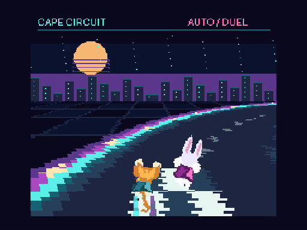

# CAPE CIRCUIT — V9968 LRMM racing demo

**V9968のLRMMを試すための、操作不要の技術デモです。**

スーパーキャットとスーパーウサギがマントで飛ぶ、操作不要のオリジナル競争デモです。架空のネオンコースを周回します。既存作品の画像・コース・ロゴ・楽曲は使用していません。後ろ姿の猫は当プロジェクトのSUPER CATで描いたオリジナル素材、ウサギと背景は本デモ用のプログラム描画です。

## 実行

MSX turbo R / R800 / V9968 新仕様 / VRAM 256KB / 内蔵I/O 98h–9Ch / ASCII8 / 512KiB ROM。
`outputs/CAPE-CIRCUIT-V9968.rom`を読み込むと自動再生します。入力・衝突判定・勝敗のあるゲームではありません。320場面、約10.68秒のループです。

- openMSX: V9968対応版の `Panasonic_FS-A1ST_V9968`、`V9968`モード。`V9968_OLD`を使わないでください。
- BlueMSX Plus: V9968対応experimental版、FS-A1ST相当、VRAM256KB、ASCII8。速度100%。
- BIOS・エミュレータ本体は同梱していません。

## 描画

256×212 SCREEN5。上部は旋回に連動するパノラマ、下部120走査線はLRMMで各線のSX/SY/VX/VYを変更して投影します。単一の256×512コース原画を、視点・方角・距離に応じて実行時に拡縮・回転・サンプリングします。録画済みの地面画像を再生する方式ではありません。

自動走行のカメラ・競争相手の位置は事前計算した1024バイト×320フレームの表です。先頭960バイトは120走査線の座標と増分、残りはスプライトと遠景スクロールの状態。R800は表の転送と描画命令、V9968が画像変換を担当します。LRMMコマンド完了後に次のコマンドを発行し、表示ページとスプライト属性表をVBlankで切り替えます。

猫とウサギは進行方向を向いた後ろ姿で、Sprite mode3の拡縮と傾き別ポーズを使用します。傾きはコースの曲率と左右移動に連動します。前版より周回速度を2.4倍にし、走行表を短くして画質・描画走査線数を維持したままROM容量を半減しました。猫の背中の短いマントと半透明の航跡を重ねます。VRAMは表示2ページ、属性表、コース、キャラクター、パノラマを分離しています。ROMは524,288バイトです。

## 検証と動画

2026-09-25にopenMSXとBlueMSX Plusの双方で起動・表示を確認しました。詳細とEXE/ROMハッシュはoutputsのverification JSONを参照してください。

openMSXで41エミュレータ秒、1,043表示更新を検査し、連番・ループ・交互ページ・切り替え前の描画完了を確認。更新頻度はエミュレータ時間で約29.96回/秒。BlueMSX Plusは目視と保存状態のVRAM256KB、R20/R21、原画128KB、表示属性の照合です。両者を同じ検査量と扱わず、実機動作・実機速度も未確認です。

プレビューMP4はopenMSXの実行録画です。早回し・補間なし。既存デモのROMは変更していません。

## 再ビルド

Python 3、Pillow、Pasmoを用意し、`PASMO`環境変数にPasmoの場所を設定するかPATHを通して `python tools/build.py` を実行します。生成画像と走行表も再作成します。所有BIOSを含むエミュレータ保存状態は配布物に含めません。

試作・無保証です。将来のゲーム化、継続サポート、すべての環境での動作は約束しません。

## English

CAPE CIRCUIT is a noninteractive technical demo for experimenting with V9968 LRMM. Super Cat and Super Rabbit race along an original neon course. The 512KiB ASCII8 ROM renders 120 perspective-ground scanlines using LRMM, with prerecorded transformation parameters, not prerecorded video. Tested in current-specification V9968 modes in both openMSX and BlueMSX Plus on September 25, 2026. Physical hardware and hardware performance remain unverified. Experimental and supplied without warranty.

## 利用条件

[利用条件](COPYRIGHT.md)・[免責事項](DISCLAIMER.md)・[第三者情報](THIRD_PARTY_NOTICES.md)。

[ROM](outputs/CAPE-CIRCUIT-V9968.rom) · [実行動画 / Video](outputs/CAPE-CIRCUIT-preview.mp4)
