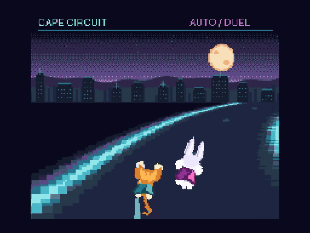

# CAPE CIRCUIT — V9968 LRMM racing demo

**V9968のLRMMを試すための、操作不要の技術デモです。**

スーパーキャットとスーパーウサギがマントで飛ぶ、操作不要のオリジナル競争デモです。架空のネオンコースを周回します。既存作品の画像・コース・ロゴ・楽曲は使用していません。後ろ姿の猫は当プロジェクトのSUPER CATで描いたオリジナル素材、ウサギと背景は本デモ用のプログラム描画です。

## 2026-09-27 更新

- LRMMの開始座標の丸め誤差を転送増分へ配分し、画面中央付近の誤差を軽減しました。整数座標の制約をなくす処理ではなく、端部の段差は残ります。
- 路面の輪郭と模様を整理し、夕空・山並み・大小の建物を描き直しました。ウサギの耳は後ろから見た白い毛の表現に修正しています。
- 月は繰り返す遠景から独立した1個のスプライトに変更。高さを固定し、左右だけゆっくり動きます。
- カメラの上昇・下降と、カーブに連動した路面バンクを追加しました。バンクは走査線ごとの転送方向へ奥行き成分を加える近似です。地形そのものの坂・遮蔽や完全な3D回転は未実装です。
- 512KiBを維持。追加描画後の平均更新頻度はopenMSXで約28.41回/秒です。

## 実行

MSX turbo R / R800 / V9968 新仕様 / VRAM 256KB / 内蔵I/O 98h–9Ch / ASCII8 / 512KiB ROM。
`outputs/CAPE-CIRCUIT-V9968.rom`を読み込むと自動再生します。入力・衝突判定・勝敗のあるゲームではありません。320場面、約11.2秒のループです。

- openMSX: V9968対応版の `Panasonic_FS-A1ST_V9968`、`V9968`モード。`V9968_OLD`を使わないでください。
- BlueMSX Plus: V9968対応experimental版、FS-A1ST相当、VRAM256KB、ASCII8。速度100%。
- BIOS・エミュレータ本体は同梱していません。

## 描画

256×212 SCREEN5。上部は旋回に連動するパノラマ、下部120走査線はLRMMで各線のSX/SY/VX/VYを変更して投影します。単一の256×512コース原画を、視点・方角・距離に応じて実行時に拡縮・回転・サンプリングします。録画済みの地面画像を再生する方式ではありません。

自動走行のカメラ・競争相手の位置は事前計算した1024バイト×320フレームの表です。先頭960バイトは120走査線の座標と増分、残り64バイトは7個のスプライト属性と終端です。終端の未使用末尾バイトに遠景スクロール量を保持します。R800は表の転送と描画命令、V9968が画像変換を担当します。LRMMコマンド完了後に次のコマンドを発行し、表示ページとスプライト属性表をVBlankで切り替えます。

猫とウサギは進行方向を向いた後ろ姿で、Sprite mode3の拡縮と傾き別ポーズを使用します。傾きはコースの曲率と左右移動に連動します。猫の背中の短いマントと半透明の航跡を重ねます。VRAMは表示2ページ、属性表、コース、キャラクター、パノラマを分離しています。ROMは524,288バイトです。

## 検証と動画

2026-09-27にopenMSXとBlueMSX Plusの双方で起動・表示を確認しました。詳細とEXE/ROMハッシュはoutputsのverification JSONを参照してください。

openMSXで45エミュレータ秒、1,103表示更新を検査し、連番・ループ・交互ページ・切り替え前の描画完了を確認。更新頻度はエミュレータ時間で平均約28.41回/秒（前版は約29.96回/秒）。BlueMSX Plusは目視と保存状態のVRAM256KB、R20/R21、原画128KB、表示属性の照合です。両者を同じ検査量と扱わず、実機動作・実機速度も未確認です。

プレビューMP4はopenMSXの実行録画です。早回し・補間なし。既存デモのROMは変更していません。

## 座標補正の範囲

同一カメラ条件の中央X=128における座標誤差RMSは、補正前0.323から補正後0.144原画画素でした。画面全体の画質改善率ではありません。[比較値](outputs/coordinate-comparison.json)。中央から左右に分割する比較実装も収録していますが、今回の未最適化実装では約11.98回/秒へ低下したため既定では使用しません。これはVDPの性能上限を示す結果ではありません。

## 再ビルド

Python 3、Pillow、Pasmoを用意し、`PASMO`環境変数にPasmoの場所を設定するかPATHを通して `python tools/build.py` を実行します。生成画像と走行表も再作成します。通常は環境変数 `CAPE_SPLIT` を設定せずにビルドしてください。`CAPE_SPLIT=1` は低速な左右分割の比較実験用で、配布ROMと異なり通常の速度検証基準を満たしません。所有BIOSを含むエミュレータ保存状態は配布物に含めません。

試作・無保証です。将来のゲーム化、継続サポート、すべての環境での動作は約束しません。

## English

CAPE CIRCUIT is a noninteractive technical demo for experimenting with V9968 LRMM. Super Cat and Super Rabbit race along an original neon course. The 512KiB ASCII8 ROM renders 120 perspective-ground scanlines using LRMM, with prerecorded transformation parameters, not prerecorded video. Tested in current-specification V9968 modes in both openMSX and BlueMSX Plus on September 27, 2026. The September 27 update refines sampling and scenery, corrects rear-view rabbit ears, draws one moon at a fixed vertical position, and adds camera-height changes and an approximate road-bank effect. Actual hilly terrain and full camera roll are not implemented. Measured updates average 28.41 per emulated second in openMSX, compared with 29.96 previously. Physical hardware and hardware performance remain unverified. Experimental and supplied without warranty.

## 利用条件

[利用条件](COPYRIGHT.md)・[免責事項](DISCLAIMER.md)・[第三者情報](THIRD_PARTY_NOTICES.md)。

[ROM](outputs/CAPE-CIRCUIT-V9968.rom) · [実行動画 / Video](outputs/CAPE-CIRCUIT-preview.mp4)

## 新旧比較 / Before and after

[新旧比較動画](outputs/CAPE-CIRCUIT-before-after.mp4)：左は2026-09-25初回公開版、右は2026-09-27最新版。両方のopenMSX実行録画を同じ経過時間で等速再生しています。更新頻度・カメラ演出が異なるため、同じコース位置を常に同期させた比較ではありません。音声は新版のみです。表示値はエミュレータ時間での平均描画更新頻度で、動画のフレームレートや実機性能ではありません。

Left: original September 25 version. Right: September 27 update. Both emulator captures play at their recorded speed, without retiming or interpolation. Course positions gradually differ. Audio is from the new version only; labels show average rendering updates per emulated second, not physical-hardware performance.
