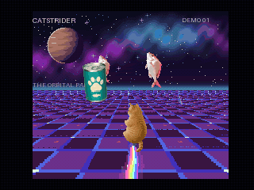

# CATSTRIDER — V9968 cosmic cat demo

## openMSX 194a769 対応版（2026-09-22）

最新版向けには **[対応ROM](outputs/CATSTRIDER-V9968-openmsx-194a769-internal.rom)** と **`V9968_OLD` の互換マシン設定**を組み合わせてください。通常の `V9968` 設定では表示が崩れます。旧ROMと新ROMの混用も避けてください。

[設定・変更点・全デモの対応表](../../UPDATE-20260922.md) · [最新版での12秒実行動画](outputs/CATSTRIDER-194a769.mp4) · [外付け用ROM](outputs/CATSTRIDER-V9968-openmsx-194a769-external.rom)

SCREEN8＋SP3をリニアVRAM配置へ変更し、旧版用のスプライト属性の二重書込みを廃止しました。素材・航路・演出内容は維持しています。内蔵／外付け構成で各65秒、ループ・両表示ページ・属性・原画転送を検証済みです。実機は未検証です。再ビルドは `python tools/build_updated.py`。下記の旧動画・ZIP・`tools/build.py` は d884c4b 向けの記録として残しています。

**English:** For openMSX 194a769 use the new ROM above **with the V9968_OLD compatibility XML**, not the default V9968 model. Linear SCREEN8/SP3 addressing replaces the old planar upload and duplicate SAT writes. Both port profiles passed 65-second emulator checks. The original artwork and choreography are retained; hardware remains untested. Older downloads below target d884c4b.

斜め後ろ姿の猫が、宇宙の床を滑走し、写真調の猫缶と巨大な魚に出会う技術デモです。写真のような毛並み、魚の鱗、金属缶とミーム風の不条理な雰囲気を、**MSX turbo R + V9968 / 512 KiB ASCII8 ROM** へ持ち込みます。

**自動再生・操作なしの1ステージ**です。導入、宇宙の中盤、巨大魚、フィナーレまで、1536フレームを再生します。内蔵・外付け構成のopenMSX実測は約29.96更新／秒、一周は約51.3秒です。起動待ち時間は含みません。

[全編MP4・PSG音声付き](outputs/CATSTRIDER-smooth.mp4) / [ROM・ソース一式](outputs/CATSTRIDER-V9968-source.zip) / [実装メモ](TECHNIQUES.md)

## 見どころ

- 遠近感のある床を、112走査線それぞれにV9968のLRMMで描画。
- Sprite mode3で猫・魚・缶・光を拡大縮小し、半透明を合成。
- 猫の原画を15色へ変換。後ろ姿を保ったまま左右に傾き、最後は奥へ飛び去ります。
- 色が変わる床、広がる光のリング、横をかすめる星、長い虹、奥へ収束する3本のビーム。
- 銀色と淡いピンクの鯛、肉球ラベルの架空の猫缶、巨大な写真調の魚。テンポの速い180 BPMのオリジナルPSG曲を合わせます。

ネコ素材はAI生成です。

魚と猫缶の素材もAI生成です。

完成画面の動画をROMに格納して再生する方式ではありません。原画と事前計算した動きからVDPが画面を作ります。一方、フル3Dの座標変換や物理演算をリアルタイムに行う実装でもありません。

## 起動とビルド

対象は[buppu3氏のV9968対応openMSX](https://buppu3.github.io/)、ソース識別子 **d884c4b** の構成です。

| 構成 | マシン・拡張 | ROM |
|---|---|---|
| 内蔵VDP、I/O 98h | `Panasonic_FS-A1ST_V9968` | `outputs/CATSTRIDER-V9968-legacy-openmsx-internal.rom` |
| 外付けVDP、I/O 88h | `Panasonic_FS-A1ST` + `HRA_V9968` | `outputs/CATSTRIDER-V9968-legacy-openmsx.rom` |

両方ともASCII8です。内蔵構成は `run-demo.cmd` から起動できます。外付け構成はopenMSXで対応マシン・拡張・ROMを選び、映像出力を `V9968` にしてください。通常のV9968未対応openMSXでは動きません。マシンXML、BIOS、エミュレーターは各利用条件に従って別途用意します。

ビルドにはPython、Pillow、Pasmoが必要です。用意後、`newbuild.cmd` または `python tools/build.py` を実行します。既定と異なる場所では `PYTHON_EXE`、`PASMO`、`OPENMSX_EXE` をそれぞれ設定できます。飛行中の猫は `art-source/cat-flight-key.png` を使用します。魚と猫缶の元画像は `art-source/fish-photo-key.png` と `art-source/can-photo-key.png` で、`tools/photo_props.py` がハードウェア用の色・サイズへ変換します。ステージの動きは `tools/stage.py`、虹などの効果は `tools/props.py`、リングと星の光跡は `tools/effects.py` です。

サングラスを掛けた正面素材 `art-source/cat-front-sunglasses-key.png` は、未使用のアトラス枠に保持しています。デモ中は一貫して後ろ姿です。元の `art-source/cat-key.png` は、既存パレットを安定させるための色決定にのみ使います。

## 検証と利用条件

今回のROMをopenMSXの[内蔵構成](outputs/runtime-verification-legacy-openmsx-internal.json)・[外付け構成](outputs/runtime-verification-legacy-openmsx.json)で各54秒実行し、一周後の再開を確認しました。両方とも1618回の表示更新、毎回2 VDPフレーム間隔、112本のLRMM走査線描画を記録しています。表示中ページへの書込み、描画未完了または垂直帰線期間外の表示切替は0件で、VRAM転送内容も一致しました。

[全1536フレームのデータ検証](outputs/asset-verification.json)と[素材差し替えの範囲確認](outputs/photo-enemy-change-verification.json)も収録しています。[動画検証](outputs/video-verification.json)は同じ内蔵版ROMの録画に対応します。MP4は54秒・3236表示フレーム・59.92 fpsとPSG音声を保持し、フレーム補間はしていません。GIFは30 fps、5秒地点から15秒の抜粋です。

**実機・現行FPGA仕様での動作や性能は未検証です。** このROMはd884c4b向けで、現在のFPGA向けに確認済みの製品ではありません。試作・無保証であり、修正、サポート、将来のゲーム化は約束していません。[免責事項](DISCLAIMER.md)・[利用条件](COPYRIGHT.md)・[第三者情報](THIRD_PARTY_NOTICES.md)をご確認ください。

背景・光の効果・動きのデータは本作向けのプログラム生成です。既存ゲームの画面や楽曲、ユーザーの写真は配布物に含みません。

## English

**CATSTRIDER** is an original 512 KiB ASCII8 technical demo for MSX turbo R + V9968. A photographic-looking cat glides through a cosmic scene with silver-and-pink sea bream, generic cat-food tins bearing a paw label, and a giant photographic fish. The cat keeps its rear flight pose, banks left and right, and flies away into the distance at the end. This is a noninteractive, automatic single-stage presentation with 1536 records. Both openMSX configurations measured about 29.96 scene updates per second, approximately 51.3 seconds per loop after startup.

The VDP draws 112 perspective floor scanlines with LRMM and uses up to 16 Sprite mode3 planes for scaled billboards and transparency. Palette animation, expanding rings, incoming star streaks, a long rainbow and three receding beams accompany an original 180 BPM PSG tune. Motion is precomputed; this is neither a stored full-screen movie nor a full real-time 3D engine.

The cat asset is AI-generated.

The fish and cat-food tin assets are also AI-generated. `tools/photo_props.py` converts them to native sprite sizes and limited hardware palettes.

The front-facing sunglasses asset is retained in an unused atlas slot; the demo stays rear-facing throughout. The original `cat-key.png` serves only as a stable palette seed.

Both d884c4b V9968-enabled openMSX configurations passed 54-second runs, including loop restart, exact two-frame presentation cadence, 112 LRMM rows per update and byte-exact VRAM upload. No visible-page writes or unsafe presentations were observed. The MP4 retains all 3236 native display frames at 59.92 fps and recorded PSG sound without interpolation. The GIF is a 30 fps, 15-second excerpt starting at 5 seconds. Linked reports identify the tested ROMs by SHA-256.

Physical hardware and the current FPGA configuration are unverified. Provided as an experimental sample without warranty, support commitment or a promise of a future game. System ROMs, emulator binaries, machine XML and user photographs are not bundled.
