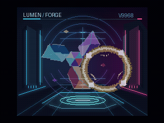

# LUMEN / FORGE — V9968 kinetic light study

暗い展示室に浮かぶ三枚の結晶と、逆方向へ回る金色の光輪。**回転・拡大・縮小・半透明を同時に使う、MSX turbo R + V9968用の512KiB ASCII8技術デモ**です。

前作の宇宙風景から構図を変え、背景の建築や文字を固定しました。回転はV9968のLRMMコマンドで原画を毎回描き直し、拡縮と半透明はSprite mode3で表示します。録画映像や角度ごとの完成画像をROMから再生する方式ではありません。



滑らかさは **[実行動画・PSG音声付きMP4](outputs/LUMEN_FORGE-smooth.mp4)** で確認できます。エミュレーター内蔵録画の約59.92fpsを維持し、フレーム補間や再生速度の変更はしていません。GIFは30fpsのプレビューです。

## 見どころ

| 表現 | 使っている機能 |
|---|---|
| 青・紫・朱色の半透明の結晶 | 128×128の原画をFG4付きLRMMで回転、8枚の16×128 Sprite3で拡縮、TP2で背景と混色 |
| 結晶と逆方向へ回る光輪 | 別の64×64原画を2本目のLRMMで回転、4枚のSprite3で縦横別に拡縮、TP1で混色 |
| 小さな光の粒 | 2枚のSprite3、TP3で混色 |
| 安定した展示室と照明 | SCREEN8、32768色から選ぶ256色パレット。背景192色＋動体64色 |
| 変形途中の画像を見せない | 裏側の原画2面へ描き、コマンド完了後のVBlankで属性表と原画を切替 |

結晶は表示幅117〜161画素まで変化します。14枚のスプライトを使い、全1024レコードで走査線上限16枚以内を確認しています。透明スプライト同士が何層も重なる合成ではなく、優先された1枚と背景の混色です。

両エミュレーター構成をそれぞれ50秒間動かし、測定区間の更新は約59.93回／秒でした。約17.1秒のループ境界も確認しています。これは実機の速度保証ではありません。

制作者向けの技術サンプルとして作成しました。ゲームの操作、スコア、戦闘はありません。PRISM FLIGHTとAURORA VEILは別フォルダーに保管し、このデモで変更していません。

## 起動

検証対象は[buppu3氏のV9968対応openMSX](https://buppu3.github.io/)のWindows版、ソース識別子 **d884c4b** です。通常のV9968未対応版では動きません。

- 内蔵VDP構成：`Panasonic_FS-A1ST_V9968` ＋ `outputs/LUMEN_FORGE-V9968-legacy-openmsx-internal.rom`。
- 外付け構成：`Panasonic_FS-A1ST` ＋ `HRA_V9968` ＋ `outputs/LUMEN_FORGE-V9968-legacy-openmsx.rom`。映像出力は `V9968` を選択します。
- マッパーは **ASCII8**。ROMはどちらも **512KiB**。起動後、原画転送が終わるまで数秒待ちます。

設定済みのWindows環境では `run-demo.cmd` でも起動できます。既定の実行ファイルは `C:/Program Files/openMSX/openmsx.exe`。別の場所は `OPENMSX_EXE` 環境変数で指定します。

必要に応じて作者配布の[マシンXML](https://buppu3.github.io/openMSX/share/machines/Panasonic_FS-A1ST_V9968.xml)と[外付け拡張XML](https://buppu3.github.io/openMSX/share/extensions/HRA_V9968.xml)をエミュレーターへ導入してください。BIOS・エミュレーター・XMLは同梱していません。システムROMは各自で利用条件に従って用意してください。

## 利用条件

[免責事項](DISCLAIMER.md)、[利用条件](COPYRIGHT.md)、[第三者のツール・資料](THIRD_PARTY_NOTICES.md)を参照してください。ROMの個人的な動作確認は許可しています。ソース・素材全体への包括的なオープンソースライセンスは未設定です。

## 検証と免責

**実機での動作・速度は未確認です。** 本作は実験的な技術サンプルで、無保証です。修正やサポートの継続を約束するものではありません。

エミュレーターの起動・R800 DRAMモード・ループ継続・素材転送・描画速度は `outputs/verification.json` に記録しています。回転後の原画は `transform-verification-legacy-openmsx-internal.json`、半透明の実画像比較は `alpha-verification.json`、再ビルド一致は `reproducibility.json` を参照してください。エミュレーターの測定値を実機の性能値として扱わないでください。

現行FPGAと検証版エミュレーターでは拡張レジスターの配置に差があります。またSCREEN8のSprite3属性表転送は、検証版の物理連続読出しに合わせた二重書込みを使用します。現行FPGA実機用として検証済みのROMは含みません。[実装メモ](TECHNIQUES.md)に差異とアドレスを記載しています。

## 再ビルド

原画とモーションパラメーターは `tools/generate.py` から生成します。Python 3.13 / Pillow 12.2.0 / Pasmoを使用しました。

```powershell
python -m pip install -r requirements.txt
$env:PASMO = 'C:/path/to/pasmo.exe'
python tools/build.py
python tools/verify_motion.py
python tools/verify.py
python tools/verify_transform.py
python tools/verify_transform.py --profile legacy-openmsx
python tools/alpha_probe.py
$env:FFMPEG = 'C:/path/to/ffmpeg.exe'
python tools/encode_video.py
python tools/package.py
```

実行検証には対応エミュレーターとシステムROMが必要です。ffmpegは動画変換だけに使用し、同梱していません。完成画面を見てから原画の色・形・動きを調整するため、実行PNGとMP4も添付しています。

## English

**LUMEN / FORGE** is an original 512 KiB ASCII8 technical demo for MSX turbo R + V9968. A translucent crystal sculpture and a counter-rotating engraved halo float inside a stationary illuminated chamber.

Two live LRMM commands with **FG4** transform 4bpp source artwork while SCREEN8 remains displayed. Sprite mode3 then scales the resulting textures and blends them with the background. The ROM contains source artwork and motion parameters, not pre-rendered rotation frames or video. Double-buffered sprite atlases and attribute tables are presented after command completion during VBlank. Fourteen sprite planes stay within the sixteen-per-line limit.

Use the d884c4b V9968-enabled Windows openMSX configuration above, with the matching internal or external ROM and **ASCII8** mapper. The MP4 preserves the native emulator recording cadence of about 59.92 fps and includes PSG audio, without frame interpolation. The GIF preview is 30 fps.

This is an experimental technical sample for creators, without gameplay. Hardware operation and performance are unverified. The emulator-specific SCREEN8/Sprite3 addressing workaround is documented in `TECHNIQUES.md`; no validated current-FPGA hardware build is included. Provided without warranty or a commitment to support. BIOS, emulator binaries and machine XML files are not distributed.

See [usage terms](COPYRIGHT.md), [disclaimer](DISCLAIMER.md) and [third-party notices](THIRD_PARTY_NOTICES.md). ROM downloads and personal testing are permitted; no blanket open-source license is assigned.

Thanks to HRA! for the [V9968 specifications and FPGA implementation](https://github.com/hra1129/V9968_Cartridge), and buppu3 for the [V9968 emulator](https://github.com/buppu3/openMSX/tree/d884c4b29d7e736d6e488aca5f28e124a410c19f).
