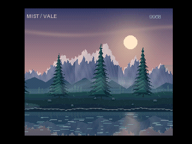

# MIST / VALE — V9968 forest and water study

朝焼けの山、木々と一緒に水平に流れる手前の岸辺、少し速く斜めへ漂う霧、波打つ水面。**MSX turbo R + V9968 / 512KiB ASCII8** の自動再生デモです。

山・空・遠い森は固定し、木々とその足元の岸辺を同じ位置変化で水平に動かします。霧の半透明にはSprite mode3、水面の揺らぎには走査線割り込みを使います。既存のPRISM FLIGHT・AURORA VEIL・LUMEN / FORGEから独立したサンプルです。



**[滑らかなMP4・PSG音声付き](outputs/MIST_VALE-smooth.mp4)** / [ROM・ソース一式](outputs/MIST_VALE-source-and-ROM.zip)

GIFは30fpsのプレビューです。MP4はエミュレーター内蔵録画のフレームレートを保持し、フレーム補間・再生速度の変更は行いません。

## 画面の構成

| 見た目の層 | 動き | 実装 |
|---|---|---|
| 朝焼け・山・遠い森 | 固定 | SCREEN8の背景原画 |
| 手前の岸辺・木々5本 | 同じ位置変化で水平スクロール | VDPで透明部分を合成し、不透明な地面は高速コピー |
| 霧3本 | 木々より約1.6倍速く、浅い角度で斜めに移動 | 12枚の拡大Sprite3、75%透明 |
| 水面 | 小さな横揺れ | R19走査線割り込みでR27を4ラインごとに変更 |

背景の独立したハードウェアレイヤーを3面使っているわけではありません。山・手前の岸辺・木々を裏画面で合成し、その完成した背景に霧を重ねます。岸辺と木々は同じスクロール量から座標を求めるため、木の足元が地面に対して滑りません。霧は山と木の両方を透かせます。半透明スプライト同士が多段で混色される方式ではなく、優先された1枚と背景が混ざります。

水面は画面下部に分け、ラスタによる横ずらしが山・岸辺・木々へ掛からない構図にしています。ずらし量は0〜4画素で、2画素を中心に±2画素です。霧は背景の横スクロールとは独立しています。

## 起動

今回の対象は[buppu3氏のV9968対応openMSX](https://buppu3.github.io/) Windows版、ソース識別子 **d884c4b** です。V9968未対応の通常版では動きません。

- 内蔵：`Panasonic_FS-A1ST_V9968` ＋ `outputs/MIST_VALE-V9968-legacy-openmsx-internal.rom`。
- 外付け：`Panasonic_FS-A1ST` ＋ `HRA_V9968` ＋ `outputs/MIST_VALE-V9968-legacy-openmsx.rom`。映像出力を `V9968` にします。
- どちらも **ASCII8、512KiB**。起動後、原画転送が終わるまで数秒待つと自動再生します。

設定済みのWindows環境では `run-demo.cmd` を実行できます。既定は `C:/Program Files/openMSX/openmsx.exe`。別の場所は環境変数 `OPENMSX_EXE` で指定します。

必要に応じて作者配布の[マシンXML](https://buppu3.github.io/openMSX/share/machines/Panasonic_FS-A1ST_V9968.xml)・[外付け拡張XML](https://buppu3.github.io/openMSX/share/extensions/HRA_V9968.xml)を導入してください。BIOS・エミュレーター・XMLは同梱していません。

## 検証と利用条件

本作は試作中の技術サンプルです。**実機での動作・速度は未確認、無保証です。** 不具合修正やサポートの継続を約束するものではありません。[免責事項](DISCLAIMER.md)・[利用条件](COPYRIGHT.md)・[第三者情報](THIRD_PARTY_NOTICES.md)をご確認ください。

現行FPGAと検証版エミュレーターでは拡張レジスター配置に差があり、SCREEN8のSprite3属性転送には検証版向けの二重書込みを使います。現行FPGA実機向けとして検証済みのROMではありません。

連続動作・速度は `outputs/verification.json`、背景合成と実際のラスタ書込みは `outputs/scene-verification-*.json`、ROMの再ビルド一致は `outputs/reproducibility.json` を参照してください。エミュレーターの値は実機性能を示すものではありません。

## ビルドと変更

Python 3.13 / Pillow 12.2.0 / Pasmoで作成しました。`tools/generate.py` が全原画・座標テーブル・ラスタ波形を生成します。ROMに録画フレームは含みません。

```powershell
python -m pip install -r requirements.txt
$env:PASMO = 'C:/path/to/pasmo.exe'
python tools/build.py
python tools/verify_motion.py
python tools/verify.py
python tools/verify_scene.py --alpha
python tools/verify_scene.py --profile legacy-openmsx --alpha
$env:FFMPEG = 'C:/path/to/ffmpeg.exe'
python tools/encode_video.py
python tools/package.py
```

実行検証には対応エミュレーターと利用条件に従って用意したシステムROMが必要です。動画変換用ffmpegは同梱していません。詳しくは[実装メモ](TECHNIQUES.md)を参照してください。

## English

**MIST / VALE** is an original 512 KiB ASCII8 technical demo for MSX turbo R + V9968. The dawn sky, mountains and distant forest stay fixed. Foreground trees and their riverbank scroll horizontally together, with faster gently diagonal translucent fog and raster-driven water ripples. There is no gameplay.

The foreground bank and trees are composited into an offscreen SCREEN8 bitmap. LMMM TIMP skips transparent pixels around the trees and upper bank edge; HMMM copies the opaque lower bank. Sprite mode3 fog then blends with the completed image. Both bank and tree positions use the same horizontal displacement, keeping the trees attached to their ground. These are software-composited visual layers, not three independently scrolling hardware background planes. Twelve sprite planes provide three fog wisps at75% transparency. Only the winning sprite blends with the background.

R19 line interrupts change R27 in four-line bands over the water. The mountains, foreground bank and trees are above this raster region. The MP4 preserves native emulator recording cadence and PSG audio without frame interpolation; the GIF preview is30fps.

Use the d884c4b V9968-enabled Windows openMSX and the matching internal/external ROM above with ASCII8. Hardware operation/performance is unverified, and this is not a validated current-FPGA hardware build. Provided as an experimental sample without warranty or a commitment to support. System ROMs, emulator binaries and XML files are not bundled. See the usage terms, disclaimer and technical notes.
