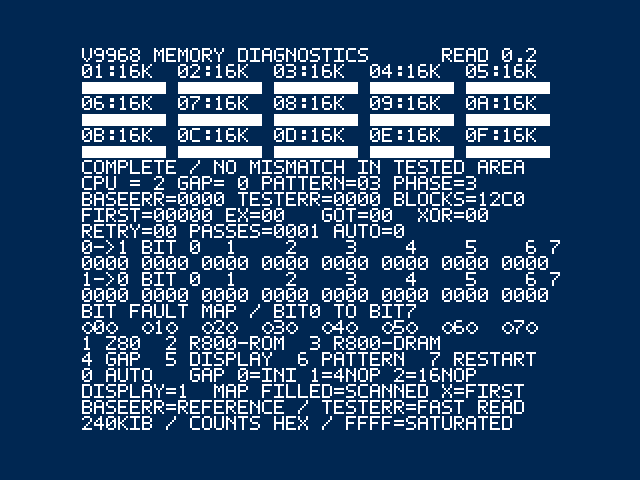

# V9968 VRAM READ LAB v0.2

V9968実機のCPU→VRAM読み出しを調べるための診断ROMです。既存デモとは独立しています。**実機未検証・試作・無保証**。測定に使用するVRAM内容を上書きします。他のソフトと同時には使用しません。ボード設定やFPGA、フラッシュの内容は変更しません。

**試作公開：openMSXで検証。BlueMSX Plus・実機は未確認です。既存デモの検証状況とは異なります。**

## v0.2 表示の変更

Memtest風の濃紺背景・白文字と、デフラグ風の領域マップを追加しました。エラーでも全面赤にはなりません。

- 上部の01〜0Fは各16KiBのVRAM領域です。00は表示用の予約領域なので検査対象に含めません。
- 空枠=未走査、塗りつぶし=走査済み、X=最初の測定エラーを記録した領域。塗りつぶし自体は「正常」の保証ではありません。BASEERR/TESTERRも確認してください。
- 下部のBIT FAULT MAPは、各ビットの累積不一致があればXを表示します。
- 読み出し・比較・CPU切替・キー操作のルーチンはv0.1と同じです。SCREEN 0を維持し、画面更新時だけ表示を作ります。変更はフォント、配色、レイアウト、マップです。
- v0.2では正常、故障注入、Z80、表示OFF、外付け88hを再検証し、キー操作とカウンター飽和・自動停止も確認しています。v0.1の24条件の結果と区別して、同梱JSONはv0.2の再検証結果です。

## 実機で最初に試す

- 外付けV9968カートリッジが **88h〜8Ch** に設定されている場合は、`out/V9968-VRAM-DIAG-EXTERNAL-88.rom` を使用してください。32KiBの通常ROMです。ASCII8 MegaROMではありません。Flashカートリッジのローダーでは通常の32KiB ROMとして扱ってください。ローダー固有の設定は未検証です。
- V9968の映像出力につないでください。MSX本体側の出力では結果が見えないことがあります。
- 起動時はZ80、間隔追加なし、アドレスパターンの1巡を実行します。`PHASE=3` が完了です。`BLOCKS=12C0` は正常に全区間を検査し終えたときの4800ブロック（1ブロック256バイト、基準読み1回＋測定読み4回）です。
- `BASEERR=0000` と `TESTERR=0000` を確認してから、**3キーを押して離し、R800 DRAMで再試験**してください。CPU欄の `0/1/2` はZ80/R800 ROM/R800 DRAMです。
- 結果を写真で保存してください。エラーが出た場合は、設定変更前に撮影し、4キーで間隔を増やして比較してください。
- `INTERNAL-98.rom` は内蔵98h〜9Ch構成用です。外付け88hの実機向けROMと取り違えないでください。ボードの実際のI/O設定が異なる場合は、この2本をそのまま使えません。

対象：MSX2以降のBIOSと32KiB以上の使用可能なRAM。R800比較はTurbo Rのみ。実際に検証した機種構成は下記に限定されます。

## 操作

設定を変えるとカウンターをクリアして書き込みから再実行します。初期書き込み中はキーを読みません。READ中はキーを押したまましばらく待ち、離してください。完了画面ではすぐ受け付けます。

| キー | 操作 |
|---|---|
| 1 | Z80 |
| 2 | R800 ROMモード |
| 3 | R800 DRAMモード |
| 4 | 読み間隔 0→1→2→0 |
| 5 | 測定中の表示ON/OFF。OFFでは検査中に画面が消え、完了時に戻ります |
| 6 | パターン切替 00〜0B |
| 7 | 同じ設定で最初から再検査 |
| 0 | 自動反復ON/OFF。異常があれば、その巡回の終了後に結果を保持して停止 |

読み間隔は、0=256回の展開したINI、1=各INIに4 NOP追加、2=16 NOP追加です。**ハードウェアのWAIT信号を追加する機能ではありません**。CPUによりNOPやRAMアクセスの時間は異なるため、数値をそのままナノ秒やWAIT数と読まないでください。

パターン：00=全00、01=全FF、02=AA/55交互、03=アドレス依存、04〜0B=1ビットずつのwalking-one。

## 表示の読み方

- BASEERR：Z80で十分間隔を空けた基準読みの不一致バイト数。これが非ゼロなら、書き込み・アドレス設定・基準読み等にも問題があり、「高速読みだけの故障」とは判断できません。
- TESTERR：選択したCPU・読み間隔での不一致バイト数。同じアドレスを4回読み、その都度計数します。
- FIRST：測定側で最初に不一致になった18ビットVRAMアドレス（5桁HEX）。EX=期待値、GOT=読み値、XOR=差分ビット。
- RETRY：最初の不一致アドレスを、同じCPUで読みアドレスを再設定し、十分間隔を置いて再読した値。
- 0→1 / 1→0：ビット0〜7ごとの方向別不一致数。左端がbit0です。
- PASSES：検査が完了した巡回数。AUTO=1で正常なら書き込み済み領域の読みを反復します。
- カウンターは16ビット、FFFFで飽和します。ゼロに戻りません。FIRST等がゼロでもTESTERRがゼロなら異常の意味はありません。

## 診断設計と限界

1. Port#4 bit7を解除し、R#21 V58=0を選択後、S#1のID=3を確認します。旧互換モードは使用しません。
2. 先頭16KiBは文字画面・フォント用に予約し、**04000h〜3FFFFhの240KiB**を検査します。先頭16KiBの完全性を保証しません。
3. 全対象領域を書いた後で読みを始め、アドレスの別名参照を見つけやすくしています。書き込みはZ80で間隔を空けます。
4. 各256バイト区間で基準読み1回と測定読み4回。データはRAMへ取り込み、取り込み完了後に照合・集計します。INI列の中に比較・画面更新・割り込みは入りません。
5. 区間ごとにR#14と読みアドレスを設定します。最初のバイトまでの待ち時間は常に長くしています。**アドレス設定直後の最短待ち、16KiB境界をまたぐ連続読み、VDPコマンド同時実行は未検査**です。
6. Spriteは使用しません。表示負荷はSCREEN 0の文字表示です。画像モード別の負荷比較・LRMM負荷・書き込み最速試験は未実装です。
7. エラーを検出しても回路の原因を断定できません。VRAM本体、アドレス系、I/O経路、電気的タイミング、CPU切替などの切り分け材料です。
8. 実行コードと採取バッファはRAMに置きます。R800 ROM/DRAM切替はしますが、カートリッジROM上のコード実行速度を測るベンチマークではありません。

## 検証

`out/verification-openmsx.json` に実行した条件・CPU制御レジスタ値・結果を保存します。Turbo Rの内蔵V9968、および外付け88h V9968の新仕様で確認します。基準・測定読みの正常系に加え、エミュレーターのデバッガーで採取RAMの1バイトを壊し、検出アドレス、値、XOR、方向別ビット件数、再読値を照合します。これは**診断ロジックの試験であり、ハードウェアのタイミング不良の再現ではありません**。

BlueMSX Plusは今回の版では未検証です。FPGA実機も未検証です。以前のデモの検証実績を本ROMの実績に流用していません。

## 設計者に伝える記録

実機型番、V9968基板・FPGA版、I/O設定、Flashカートリッジ／ローダー、接続スロット、CPU・GAP・PATTERN・DISPLAY設定、電源投入直後か長時間後か、結果画面を添えてください。BASEERR、TESTERR、FIRST/EX/GOT/XOR、RETRY、ビット別件数が特に有用です。同一設定での再現性と、GAPを増やした場合の差を比較します。

## ビルド

Python 3とPasmoを使用。`python build.py`。Pasmoは環境変数PASMO、PATH、C:/Software/Pasmo/pasmo.exeの順に探します。外部Pythonパッケージ不要。文字フォントも同梱のオリジナル5×7データから作ります。BIOS・エミュレーター・市販ROMは同梱しません。

`python verify.py` はこの作業環境向けのopenMSX自動検証スクリプトです。ユーザー所有のBIOSとV9968機種定義が別途必要です。既存の設定を書き換えず、work配下の個別HOMEで起動します。

仕様確認元：[V9968作者のレジスタマニュアル](https://github.com/hra1129/V9968_Cartridge/blob/main/fpga/V9968_Cartridge_TangNano20K/src/v9968/manual/v9968_programmers_manual_register_map.pdf)（2026-10-09取得・内容確認）。

本作は非公式の実験用診断ソフトです。V9968製作者による認定・保証を意味しません。公開先は [V9968_SampleDemo](https://github.com/kanon-ai/V9968_SampleDemo) です。

`verify_controls.py`でキー操作、`verify_edges.py`でFFFF飽和とエラー時の自動停止を追加検証します。

## 利用条件と免責

[利用条件](LICENSE.md)、[免責事項](DISCLAIMER.md)、[第三者情報](THIRD_PARTY_NOTICES.md)を同梱しています。既存V9968_SampleDemoと同じ方針で、個人的な動作確認・診断のための実行を認めます。MIT等の包括的なオープンソース許諾ではありません。
